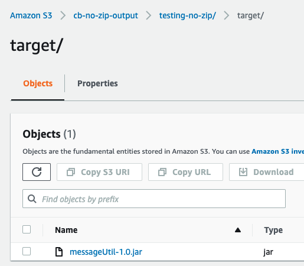

# LAB: Create a build project

## Walk-through&#x20;

We are going to have CodeBuild build some Java code for us and produce an artifact.&#x20;

Here is what happened:

* get source code from GitHub as ZIP&#x20;
* put the ZIP in S3 - that didn't work 😨
* put the code in CodeCommit - that worked
* go back to S3, upload files unzipped - that worked as well

## Preparation

First we have to prepare the source code that we want to compile. All the code is in a public GitHub repository.&#x20;

* We'll create input and output S3 buckets
* We will get the source code as a ZIP file
* We will upload the ZIP file to the input S3 bucket.

### Create S3 buckets

We will need two buckets. When you create them, just give them names and hit create - all other settings can be kept as default.&#x20;

For the names, have one of them end with "input" and the other with "output". For example:

.png>)

To make sure the names are available, it's good to use something unique like your account ID (12 digits) or your name + ddmm. Generic names like codebuild-bucket are most def already taken.

### Note: Buildspec.yml and S3

For build input stored in S3 buckets only, you must create a ZIP file that contains the source code and, by convention, a build spec file named `buildspec.yml` at the root (top level) or include the build spec declaration as part of the build project definition.

In our case the buildspec.yml is INSIDE the ZIP file, so from the point of view of CodeBuild it is not at the top level. Not to worry, we can work around that. I think.&#x20;

### Get source code

Go to [https://github.com/electron-volt/codebuild-example](https://github.com/electron-volt/codebuild-example)

Under Code, choose Download ZIP.

.png>)

You should have the ZIP file with the following contents (you don't need to unzip it):

.png>)

### Buildspec.yml

Here is what the buildspec.yml looks like. You can go take a look at the source code in /src in GitHub.&#x20;


```yaml
version: 0.2

phases:
  install:
    runtime-versions:
      java: corretto11
  pre_build:
    commands:
      - echo Nothing to do in the pre_build phase...
  build:
    commands:
      - echo Build started on `date`
      - mvn install
  post_build:
    commands:
      - echo Build completed on `date`
artifacts:
  files:
    - target/messageUtil-1.0.jar
```


### Upload to S3

Upload the ZIP into the S3 bucket with name that ends with **input**.&#x20;

## Create the build

1. Go to CodeBuild
2. Click create a build
3. Give the project a name.

### Source

Under Source, use the following settings (substitute the name of your input bucket):

.png>)

### Environment

Under Environment, use the following settings:

.png>)

### Service role

Accept the defaults: create new role and the name that AWS suggest.

### Buildspec

Use these settings:

.png>)

Adding the buildspec name is mandatory as otherwise our build would fail - CodeBuild would look for it in the wrong place.

### Artifacts

Use these settings, again substituting your output S3 bucket:

.png>)

Leave name and path blank. Packaging: None.

### Logs

Uncheck CloudWatch. We don't need logs.&#x20;

### Create build

Create build project.&#x20;

## Start build

Start the build with the orange button that says "Start build".&#x20;

You will be able to follow along as it progresses:

.png>)

If it looks stuck in "In progress", refresh the page.&#x20;

### Failure

Hmm.

.png>)

Ok clearly CodeBuild has found our buildspec.yml since it is attempting to install maven.&#x20;

Lots of googling and StackOverflow later.. no luck.&#x20;

## Switch to CodeCommit

I put all my code into a CodeCommit repository (No ZIP involved there) and created a new build. Everything went smoothly:

.png>)

## Another go at S3

Ok let's try again. Exact same ZIP from the same GitHub repo, but this time I unzip it on my local machine and upload the files to S3 unzipped.&#x20;

Here are my buckets:

.png>)

Here are the contents of the input bucket:

.png>)

### The build project

Same settings, expect for "S3 object key or S3 folder", which in this case is "test/". Also artifacts go to bucket cb-no-zip-output.&#x20;

### Run the build:

Everything runs smoothly now:

.png>)

### Artifact

My build project called "testing-no-zip" has successfully uploaded an artifact into the output bucket:



## Post-mortem

CodeBuild should work with ZIP files stored in S3, but there was something wrong with my ZIP file I suppose.&#x20;
